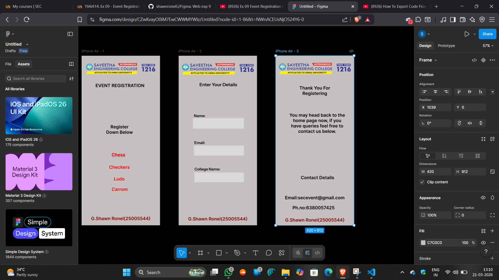

# Ex08 Event Registration Web Application
## Date:21/03/26

## AIM:
To design, develop and deploy a web application for event registration using Figma UI tool.

## UI DESIGN TOOL:
Figma

## DESIGN STEPS:

### Step 1:
Use frames to represent screens or sections.

### Step 2:
Add column grids for consistent spacing and alignment.

### Step 3:
Insert shapes, text, buttons, and icons.

### Step 4:
Use Auto Layout for flexible, responsive design.

### Step 5:
Define color, text, and effect styles globally for consistency.

### Step 6:
Name layers logically and group related elements.

### Step 6:
Link frames to show navigation or interactions.

### Step 7:
Select the specific frame while generating code using Anima plugin.

## CODE:
```
index.html page 1

<!DOCTYPE html>
<html>
  <head>
    <meta name="viewport" content="width=device-width, initial-scale=1" />
    <meta charset="utf-8" />
    <link rel="stylesheet" href="globals.css" />
    <link rel="stylesheet" href="style.css" />
  </head>
  <body>
    <div class="iphone-air">
      
      <div class="text-wrapper">EVENT REGISTRATION</div>
      <div class="div">Register Down Below</div>
      
      <div class="text-wrapper-2">Checkers</div>
      <div class="text-wrapper-3">Ludo</div>
      <div class="text-wrapper-4">Carrom</div>
      <div class="text-wrapper-5">G.Shawn Ronel(25005544)</div>
    </div>
  </body>
</html>

style.css page 1

.iphone-air {
  background-color: #c6bfbf;
  width: 100%;
  min-width: 420px;
  min-height: 912px;
  display: flex;
  flex-direction: column;
}

.iphone-air .logo {
  margin-left: 9px;
  width: 402px;
  height: 81px;
  margin-top: 28px;
  aspect-ratio: 4.97;
  object-fit: cover;
}

.iphone-air .text-wrapper {
  margin-left: 46px;
  width: 319px;
  height: 60px;
  margin-top: 37px;
  font-family: "Inter-SemiBold", Helvetica;
  font-weight: 600;
  color: #000000;
  font-size: 24px;
  text-align: center;
  letter-spacing: 0;
  line-height: normal;
}

.iphone-air .div {
  margin-left: 119px;
  width: 168px;
  height: 78px;
  margin-top: 162px;
  font-family: "Inter-SemiBold", Helvetica;
  font-weight: 600;
  color: #000000;
  font-size: 24px;
  text-align: center;
  letter-spacing: 0;
  line-height: normal;
}

.iphone-air .chess {
  margin-left: 158.2px;
  width: 78.89px;
  height: 25.95px;
  margin-top: 77.3px;
}

.iphone-air .text-wrapper-2 {
  margin-left: 118px;
  width: 169px;
  height: 35px;
  margin-top: 35.7px;
  font-family: "Inter-SemiBold", Helvetica;
  font-weight: 600;
  color: #ff0000;
  font-size: 24px;
  text-align: center;
  letter-spacing: 0;
  line-height: normal;
}

.iphone-air .text-wrapper-3 {
  margin-left: 116px;
  width: 171px;
  height: 40px;
  margin-top: 28px;
  font-family: "Inter-SemiBold", Helvetica;
  font-weight: 600;
  color: #ff0000;
  font-size: 24px;
  text-align: center;
  letter-spacing: 0;
  line-height: normal;
}

.iphone-air .text-wrapper-4 {
  margin-left: 121px;
  width: 166px;
  height: 40px;
  margin-top: 16px;
  font-family: "Inter-SemiBold", Helvetica;
  font-weight: 600;
  color: #ff0000;
  font-size: 24px;
  text-align: center;
  letter-spacing: 0;
  line-height: normal;
}

.iphone-air .text-wrapper-5 {
  width: 420px;
  height: 51px;
  margin-top: 117px;
  font-family: "Inter-SemiBold", Helvetica;
  font-weight: 600;
  color: #7f0000;
  font-size: 24px;
  text-align: center;
  letter-spacing: 0;
  line-height: normal;
}

index.html page 2

<!DOCTYPE html>
<html>
  <head>
    <meta name="viewport" content="width=device-width, initial-scale=1" />
    <meta charset="utf-8" />
    <link rel="stylesheet" href="globals.css" />
    <link rel="stylesheet" href="style.css" />
  </head>
  <body>
    <div class="iphone-air">
      
      <div class="rectangle"></div>
      <div class="div"></div>
      <div class="rectangle-2"></div>
      <div class="text-wrapper">College Name:</div>
      <div class="text-wrapper-2">Email:</div>
      <div class="text-wrapper-3">Name:</div>
      <div class="text-wrapper-4">Enter Your Details</div>
      <div class="text-wrapper-5">G.Shawn Ronel(25005544)</div>
    </div>
  </body>
</html>

style.css page 2

.iphone-air {
  background-color: #c6bfbf;
  overflow: hidden;
  width: 100%;
  min-width: 420px;
  min-height: 912px;
  position: relative;
}

.iphone-air .logo {
  position: absolute;
  top: 28px;
  left: 2px;
  width: 418px;
  height: 84px;
  aspect-ratio: 4.97;
  object-fit: cover;
}

.iphone-air .rectangle {
  top: 336px;
  left: 77px;
  width: 272px;
  height: 56px;
  position: absolute;
  background-color: #d9d9d9;
}

.iphone-air .div {
  top: 483px;
  left: 82px;
  width: 267px;
  height: 54px;
  position: absolute;
  background-color: #d9d9d9;
}

.iphone-air .rectangle-2 {
  top: 628px;
  left: 84px;
  width: 265px;
  height: 52px;
  position: absolute;
  background-color: #d9d9d9;
}

.iphone-air .text-wrapper {
  position: absolute;
  top: 598px;
  left: 85px;
  width: 139px;
  font-family: "Instrument Sans-SemiBold", Helvetica;
  font-weight: 600;
  color: #000000;
  font-size: 20px;
  letter-spacing: 0;
  line-height: normal;
}

.iphone-air .text-wrapper-2 {
  position: absolute;
  top: 456px;
  left: 84px;
  width: 133px;
  font-family: "Instrument Sans-SemiBold", Helvetica;
  font-weight: 600;
  color: #000000;
  font-size: 20px;
  letter-spacing: 0;
  line-height: normal;
}

.iphone-air .text-wrapper-3 {
  position: absolute;
  top: 311px;
  left: 82px;
  width: 154px;
  font-family: "Instrument Sans-SemiBold", Helvetica;
  font-weight: 600;
  color: #000000;
  font-size: 20px;
  letter-spacing: 0;
  line-height: normal;
}

.iphone-air .text-wrapper-4 {
  position: absolute;
  top: 141px;
  left: 95px;
  width: 235px;
  font-family: "Instrument Sans-SemiBold", Helvetica;
  font-weight: 600;
  color: #000000;
  font-size: 24px;
  text-align: center;
  letter-spacing: 0;
  line-height: normal;
}

.iphone-air .text-wrapper-5 {
  position: absolute;
  top: 863px;
  left: 0;
  width: 420px;
  font-family: "Inter-SemiBold", Helvetica;
  font-weight: 600;
  color: #7f0000;
  font-size: 24px;
  text-align: center;
  letter-spacing: 0;
  line-height: normal;
}

index.html page 3

<!DOCTYPE html>
<html>
  <head>
    <meta name="viewport" content="width=device-width, initial-scale=1" />
    <meta charset="utf-8" />
    <link rel="stylesheet" href="globals.css" />
    <link rel="stylesheet" href="style.css" />
  </head>
  <body>
    <div class="iphone-air">
      
      <div class="text-wrapper">Thank You For Registering</div>
      <p class="div">You may head back to the home page now, if you have queries feel free to contact us below.</p>
      <div class="text-wrapper-2">Contact Details</div>
      <div class="text-wrapper-3">Email:secevent@gmail.com</div>
      <div class="text-wrapper-4">Ph.no:6380057425</div>
      <div class="text-wrapper-5">G.Shawn Ronel(25005544)</div>
    </div>
  </body>
</html>

style.css page 3

.iphone-air {
  background-color: #c6bfbf;
  width: 100%;
  min-width: 420px;
  min-height: 912px;
  display: flex;
  flex-direction: column;
}

.iphone-air .logo {
  margin-left: 2px;
  width: 418px;
  height: 84px;
  margin-top: 26px;
  aspect-ratio: 4.97;
  object-fit: cover;
}

.iphone-air .text-wrapper {
  margin-left: 103px;
  width: 213px;
  height: 57px;
  margin-top: 49px;
  font-family: "Inter-SemiBold", Helvetica;
  font-weight: 600;
  color: #000000;
  font-size: 24px;
  text-align: center;
  letter-spacing: 0;
  line-height: normal;
}

.iphone-air .div {
  margin-left: 73px;
  width: 299px;
  height: 118px;
  margin-top: 89px;
  font-family: "Inter-SemiBold", Helvetica;
  font-weight: 600;
  color: #000000;
  font-size: 24px;
  text-align: center;
  letter-spacing: 0;
  line-height: normal;
}

.iphone-air .text-wrapper-2 {
  margin-left: 116px;
  width: 216px;
  height: 39px;
  margin-top: 218px;
  font-family: "Inter-SemiBold", Helvetica;
  font-weight: 600;
  color: #000000;
  font-size: 24px;
  text-align: center;
  letter-spacing: 0;
  line-height: normal;
}

.iphone-air .text-wrapper-3 {
  margin-left: 20px;
  width: 379px;
  height: 54px;
  margin-top: 69px;
  font-family: "Inter-SemiBold", Helvetica;
  font-weight: 600;
  color: #000000;
  font-size: 24px;
  text-align: center;
  letter-spacing: 0;
  line-height: normal;
}

.iphone-air .text-wrapper-4 {
  margin-left: 26px;
  width: 354px;
  height: 47px;
  font-family: "Inter-SemiBold", Helvetica;
  font-weight: 600;
  color: #000000;
  font-size: 24px;
  text-align: center;
  letter-spacing: 0;
  line-height: normal;
}

.iphone-air .text-wrapper-5 {
  width: 420px;
  height: 43px;
  margin-top: 19px;
  font-family: "Inter-SemiBold", Helvetica;
  font-weight: 600;
  color: #7f0000;
  font-size: 24px;
  text-align: center;
  letter-spacing: 0;
  line-height: normal;
}


```

## OUTPUT:


## RESULT:
The program to design, develop and deploy a web application for event registration using Figma UI tool is completed successfully.
